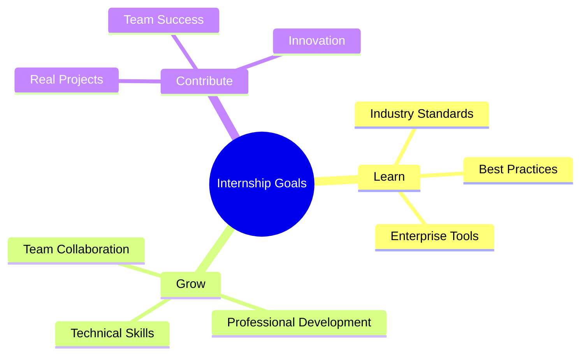

<div align="center">

# 🌊 スイカ－様

### Systems Engineering Student | Aspiring Software Developer

[](https://github.com/Suikasama123)
[](https://www.linkedin.com/in/cdom-amadeus/)
[](mailto:carlosbenj2022@gmail.com)

</div>

---

## 👋 About Me

```yaml
name: スイカ－様
role: 7th Semester Systems Engineering Student
status: 🔍 Seeking Professional Internship (Feb 2026)
languages: ["Spanish 🇪🇸", "English 🇺🇸", "Japanese 🇯🇵 (Basic)"]
interests: ["Full-Stack Dev", "Agile", "Open Source", "AI Integration"]
motto: "Always learning, always growing 🚀"
```

> 💼 **Available for internship**: Professional Practice 1 starting February 2026  
> 🎯 **Goal**: Apply academic knowledge in real-world software development projects

---

## 🛠️ Tech Stack

<div align="center">

### 💻 Languages


**Learning:**   

### 🔧 Tools & Technologies


</div>

---

## 🚀 Featured Projects

<table>
<tr>
<td width="50%">

### 💰 Personal Budget Manager
**Team Project** • *Aug - Dec 2025*

A collaborative expense tracking application built with a 5-person team using Agile methodologies.

**Highlights:**
- 📊 Data visualization & reporting
- 👥 Agile workflow with sprints
- 📱 Cross-platform compatibility

**Stack:** `Kotlin` `SQLite` `Android`

[View Project →](https://github.com/SkySwan0807/AppGestionFinan)

</td>
<td width="50%">

### 🤖 Alexa Gemini Skill
**AI Integration** • *2025*

Voice assistant skill integrating Google's Gemini AI with Amazon Alexa for intelligent conversations.

**Highlights:**
- 🎤 Voice-activated AI responses
- 🔌 Gemini API integration
- 💬 Natural language processing

**Stack:** `Python` `Alexa Skills Kit` `Gemini API`

[View Project →](https://github.com/Suikasama123/alexa-gemini-skill)

</td>
</tr>
<tr>
<td width="50%">

### 🌐 Distributed Systems Final Project
**Academic Project** • *2025*

Implementation of distributed systems concepts including communication protocols and system architecture.

**Highlights:**
- 🔄 Distributed architecture
- 📡 Inter-process communication
- 🏗️ Scalable system design

**Stack:** `Multi-language` `Networking` `Protocols`

[View Project →](https://github.com/Suikasama123/TP-FINAL_Sistemas_Distribuidos)

</td>
<td width="50%">

### 🛡️ AEGIS Lattice
**Security Project** • *2025*

Advanced security and system protection framework with lattice-based access control.

**Highlights:**
- 🔐 Security implementation
- 🏛️ Lattice architecture
- ⚙️ Access control systems

**Stack:** `Security Frameworks` `System Design`

[View Project →](https://github.com/Suikasama123/AEGIS-Lattice)

</td>
</tr>
</table>

---

## 💪 Core Competencies

<div align="center">

| 🎯 Technical Skills | 🤝 Soft Skills |
|:------------------:|:--------------:|
| Full-Stack Development | Quick Learner |
| Agile Methodologies | Team Collaboration |
| Software Testing | Code Review & Reading |
| Database Design | Deadline Management |
| System Administration | Adaptability |
| AI Integration | Open to Feedback |

</div>

---

## 📊 GitHub Analytics

<div align="center">


</div>

<div align="center">

[](https://git.io/streak-stats)

</div>

---

## 🎓 Education & Learning

```
🎓 Systems Engineering (7th Semester)
   └─ Object-Oriented Programming & Data Structures
   └─ Relational Database Design
   └─ Software Development Lifecycle
   └─ System Administration & Networking
```

**Current Learning Path:**
- 📚 Docker & Container Orchestration
- 🦀 Rust Programming Language
- 🐹 Go for Backend Development
- 🧪 Software Testing Best Practices

---

## ⏰ Internship Availability

<div align="center">

| Period | Schedule | Status |
|:------:|:--------:|:------:|
| 📅 **Feb - Mar 2026** | Mornings | ✅ Available |
| 📅 **Mar - May 2026** | Afternoons | ✅ Available |
| 📅 **May - Jun 2026** | Midday | ✅ Available |

**Duration:** Professional Practice 1 (extendable to Practice 2)

</div>

---

## 🎯 What I'm Looking For

<div align="center">



</div>

I'm seeking an internship where I can:
- 🏢 **Learn** industry standards and professional workflows
- 💡 **Apply** academic knowledge to real-world challenges
- 🤝 **Collaborate** with experienced developers
- 📈 **Grow** both technically and professionally
- 🚀 **Contribute** to meaningful projects

---

## 📫 Let's Connect!

<div align="center">

[](https://www.linkedin.com/in/cdom-amadeus/)
[](mailto:carlosbenj2022@gmail.com)
[](https://github.com/Suikasama123)

---

### 💬 *"Code is like humor. When you have to explain it, it's bad."* – Cory House

**Thanks for visiting! Let's build something amazing together** 🚀


</div>
